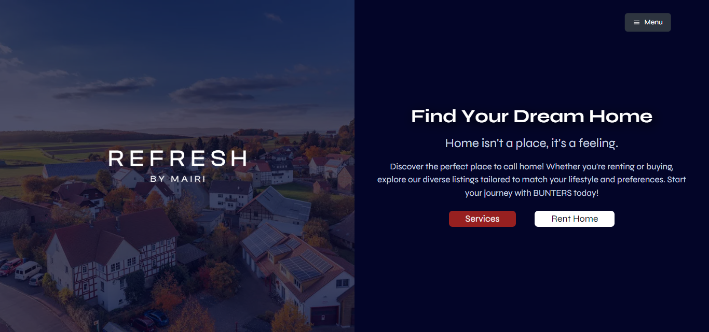

# Bunters - Real Estate Project

This project is a real estate web application built with React.js. It provides a platform for users to view rental properties.

## Tech Stack

The main technologies used in this project are:

- React.js: A JavaScript library for building user interfaces.
- React Router DOM: Declarative routing for React.
- Framer Motion: A production-ready motion library for React.
- GSAP: Professional-grade JavaScript animation for the modern web.
- Swiper: Modern mobile touch slider with hardware-accelerated transitions.
- Tailwind CSS: A utility-first CSS framework for rapidly building custom designs.

## Features

One of the main features of this application is the filter functionality on the Rent page. Users can filter properties based on various criteria to find the ones that best suit their needs.

## Installation

To clone and run this application, you'll need Git and Node.js (which comes with npm) installed on your computer. From your command line:

```bash
# Clone this repository
$ git clone https://github.com/your-username/real-estate

# Go into the repository
$ cd real-estate

# Install dependencies
$ npm install

# Run the app
$ npm start
```

## Contributing
Contributions are what make the open-source community such an amazing place to learn, inspire, and create. Any contributions you make are greatly appreciated.

    Fork the Project
    Create your Feature Branch (git checkout -b feature/AmazingFeature)
    Commit your changes (git commit -m 'Add some AmazingFeature')
    Push to the Branch (git push origin feature/AmazingFeature)
    Open a Pull Request
